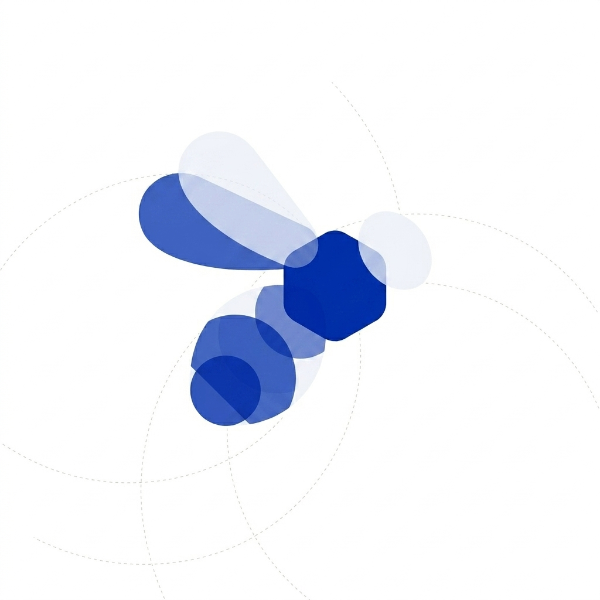

<p align="center">
  
</p>

<h1 align="center">Jswarm</h1>

<p align="center">
  <a href="LICENSE"></a>
  
  
</p>

<p align="center">
  <strong>轻量级 Java 多 Agent 编排框架</strong>
</p>

<p align="center">
  中文 | <a href="README_EN.md">English</a>
</p>

<p align="center">
  <a href="#核心概念">核心概念</a> •
  <a href="#模块结构">模块结构</a> •
  <a href="#快速开始">快速开始</a> •
  <a href="#showcase">Showcase</a> •
  <a href="#api-概览">API 概览</a> •
  <a href="#路线图">路线图</a>
</p>

---

Jswarm 专注于多 Agent 场景下的**编排层**——定义 Agent 拓扑、处理 handoff/delegate 路由、管理请求级上下文。LLM 调用、工具执行、消息存储等运行时职责由 LangChain4j（或其他适配层）承担，Jswarm 不介入。

**环境要求：** JDK 17+ · Maven 3.8+ · LangChain4j 1.15.x（adapter 模块）

---

## 核心概念

多 Agent 协同的编排层归结为两种路由原语：

### Handoff（接管）

对话控制权转交目标 Agent，保留历史消息，替换 SystemMessage。原 Agent 退出主循环。

```
用户 → router ──handoff──> tech ──> 直接回复用户
```

### Delegate（委派）

目标 Agent 在子循环中执行任务，结果作为 tool result 返回给原 Agent，原 Agent 继续主循环。

```
用户 → router ──delegate──> order ──> 结果回 router ──> 回复用户
```

框架向 LLM 自动注入两个编排工具（名称固定，用户 `@Tool` 不可同名）：

| 工具 | 语义 |
|------|------|
| `handoff` | 接管，参数 `target` |
| `delegate` | 委派，参数 `target` + `task` |

---

## 模块结构

```
开发者代码
     │
     ▼
┌──────────────────────────────────────────┐
│ jswarm-adapter-langchain4j               │  JAgent / SwarmRunner / SwarmFilter
│ LangChain4j ChatModel + @Tool 桥接       │
├──────────────────────────────────────────┤
│ jswarm-core                              │  Swarm / Agent / SwarmContext
│ 纯 JDK，零外部依赖                        │
└──────────────────────────────────────────┘
     │
     ▼
jswarm-examples          Showcase Web 演示（可选）
```

| 模块 | 说明 |
|------|------|
| `jswarm-core` | Agent 抽象、Swarm 拓扑、SwarmContext `{key}` 模板 |
| `jswarm-adapter-langchain4j` | JAgent 运行时、SwarmRunner、handoff/delegate 过滤与工具注入 |
| `jswarm-examples` | Showcase：Web UI + 智能客服演示场景 |

---

## 快速开始

### 1. 构建

```bash
git clone <your-repo-url>
cd Jswarm
mvn install -DskipTests
```

### 2. 定义 Agent 与拓扑

```java
import com.jswarm.adapter.lc4j.JAgent;
import com.jswarm.adapter.lc4j.run.SwarmRunner;
import com.jswarm.core.Swarm;
import com.jswarm.core.SwarmContext;
import dev.langchain4j.model.chat.ChatModel;
import dev.langchain4j.model.openai.OpenAiChatModel;

ChatModel model = OpenAiChatModel.builder()
        .baseUrl("https://api.deepseek.com")
        .apiKey(System.getenv("DEEPSEEK_API_KEY"))
        .modelName("deepseek-chat")
        .build();

JAgent router = JAgent.builder("router", "路由专员")
        .description("分析意图并分发")
        .instructions("你是路由专员。技术问题 handoff 到 tech，销售问题 handoff 到 sales。")
        .model(model)
        .build();

JAgent tech = JAgent.builder("tech", "技术支持")
        .description("解决技术问题")
        .instructions("你是技术支持，结合对话历史回答用户。")
        .model(model)
        .build();

JAgent sales = JAgent.builder("sales", "销售专员")
        .description("产品咨询")
        .instructions("你是销售专员，解答价格与购买问题。")
        .model(model)
        .build();

Swarm swarm = Swarm.create("customer-service")
        .agent(router).agent(tech).agent(sales)
        .entry("router")
        .handoff("router", "tech", "sales")
        .build();
```

### 3. 运行

`SwarmRunner.run()` 执行一次编排流程，从入口 Agent 开始，不维护跨轮历史。

```java
SwarmContext ctx = new SwarmContext();
ctx.put("user_name", "张三");

SwarmRunner runner = SwarmRunner.create(swarm);
String reply = runner.run("我的激活码无效，请帮我排查", ctx);
System.out.println(reply);
```

多轮对话需在应用层维护 `List<ChatMessage>` history，参考 `jswarm-examples` 中的 `ShowcaseSessionEngine`。

---

## Showcase

`jswarm-examples` 提供一个带前端的智能客服演示，覆盖 handoff、delegate、生命周期钩子、动态 instructions、`SwarmContext`、`ExternalToolExecutor` 等主要能力。

### 启动

```bash
export DEEPSEEK_API_KEY=sk-...
mvn -pl jswarm-examples exec:java
```

浏览器打开 **http://localhost:8080**

首次运行若依赖未安装：

```bash
mvn -pl jswarm-examples -am install -DskipTests
```

### Agent 拓扑

```
entry: router
  ├─ handoff → tech / sales / order
  └─ delegate → order → analyst
Swarm 级 ExternalToolExecutor: auditLog
```

会话数据持久化在 `data/showcase.db`（`.gitignore` 已忽略，本地自动生成）。

---

## API 概览

### jswarm-core

- `Agent`：id / name / description / instructions
- 生命周期钩子：`onEnter` / `onExit` / `onDelegateEnter` / `onDelegateExit`
- `Swarm` / `SwarmBuilder`：entry、handoff、delegate 拓扑声明
- `SwarmContext`：请求级 `{key}` 模板替换，ThreadLocal 隔离

### jswarm-adapter-langchain4j

- `JAgent.builder()`：构建 Agent，支持钩子 lambda 和 `@Tool` Bean 注册
- `JAgent.fromTools()` / `fromAiService()`：桥接已有 LangChain4j 接口
- `JAgent.decorate()`：装饰器模式叠加钩子
- `instructions(Function<SwarmContext, String>)`：动态 instructions
- `SwarmToolInjector`：按拓扑注入编排工具
- `SwarmFilter`：拦截 tool call，分发 handoff / delegate / 外部工具
- `SwarmRunner`：编排主循环
- `SwarmRunOptions`：`maxTurns`、错误恢复、`modelTimeout`
- `ExternalToolExecutor`：Swarm 级工具回落

### jswarm-examples

- `ShowcaseApplication`：HTTP 服务 + 静态前端
- `ShowcaseSessionEngine`：多轮会话管理
- SQLite 会话持久化

---

## SwarmContext 时序

| 时机 | instructions resolve |
|------|---------------------|
| Agent 首轮进入主循环 | ✅ |
| handoff 到目标 Agent | ✅ |
| delegate 子循环入口 | ✅（`onDelegateEnter` 先于 resolve 执行） |
| 同 Agent 内 tool 执行后 | ❌ SystemMessage 已冻结 |

动态状态建议通过 **tool result** 或 **delegate 返回值** 传递；也可在 **run 前 / onEnter / handoff 前**写入 ctx。

---

## 测试

```bash
mvn test
```

Examples 模块依赖真实 LLM，CI 通常跳过；单元测试集中在 core 和 adapter 模块。

---

## 路线图

**已完成**

- Core 拓扑与 SwarmContext
- LC4j 适配层与 SwarmRunner
- handoff / delegate 路由与工具注入
- 生命周期钩子、JAgent 扩展路径（builder / decorate / fromAiService）
- 动态 instructions、错误恢复、Showcase Web 演示

**规划中**

- 流式输出与事件回调
- `jswarm-spring-boot-starter`
- 更多模型适配器

---

## 许可证

[MIT License](LICENSE)
