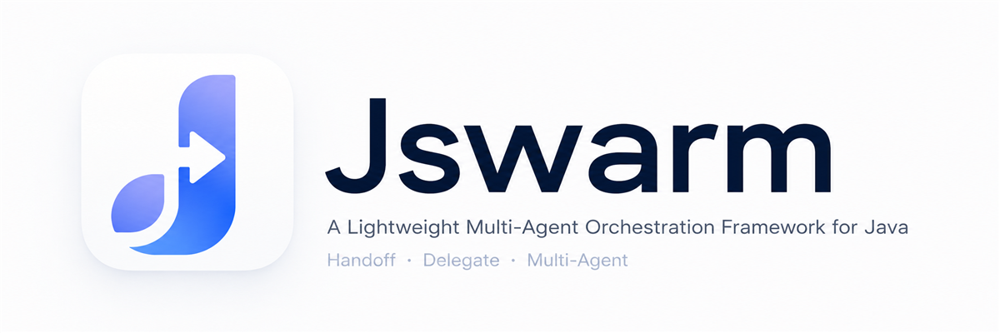

<div align="center">



</div>

<p align="center">
  <a href="LICENSE"></a>
  
  
  
  
</p>

<p align="center">
  <strong>Lightweight Multi-Agent Orchestration Framework for Java</strong>
</p>

<p align="center">
  <a href="README.md">中文</a> | English
</p>

<p align="center">
  <a href="#concepts">Concepts</a> •
  <a href="#modules">Modules</a> •
  <a href="#getting-started">Getting Started</a> •
  <a href="#showcase">Showcase</a> •
  <a href="#api-overview">API Overview</a> •
  <a href="#roadmap">Roadmap</a>
</p>

---

Jswarm handles the **orchestration layer** for multi-agent systems — agent topology, handoff/delegate routing, and request-scoped context. LLM calls, tool execution, and message storage are delegated to LangChain4j, Spring AI, or other adapters.

**Requirements:** JDK 17+ (compile `release=17`) · Maven 3.8+ · LangChain4j **1.15.1** or Spring AI **2.0.0** + Spring Boot **4.0.7**

**Canonical repository:** [github.com/acefun29/Jswarm](https://github.com/acefun29/Jswarm) · Maven coordinates `com.jswarm:*:1.0.0-SNAPSHOT`

See `adr/` for the compatibility matrix and module boundaries. Unsupported: Spring AI 2.0 + Boot 3.x.

---

## Concepts

Agent orchestration boils down to two routing primitives:

### Handoff

Transfer conversation control to the target agent. Chat history is preserved, SystemMessage is replaced. The source agent exits the main loop.

```
User → router ──handoff──> tech ──> replies to user
```

### Delegate

The target agent runs a sub-loop to complete a task. The result is returned as a tool result, and the source agent continues.

```
User → router ──delegate──> order ──> result back to router ──> replies to user
```

The framework injects two orchestration tools into the LLM automatically (names are reserved — user `@Tool` methods must not collide):

| Tool | Semantics |
|------|-----------|
| `handoff` | Transfer control, param `target` |
| `delegate` | Dispatch sub-task, params `target` + `task` |

---

## Modules

```
Application Code
     │
     ▼
┌──────────────────────────────────────────┐
│ jswarm-adapter-langchain4j               │  LangChain4j Adapter Layer
├──────────────────────────────────────────┤
│ jswarm-adapter-spring-ai                 │  Spring AI Adapter Layer
├──────────────────────────────────────────┤
│ jswarm-core                              │  Swarm / Agent / SwarmContext (Pure JDK)
└──────────────────────────────────────────┘
     │
     ▼
jswarm-examples          Showcase web demo (LangChain4j)
jswarm-examples-spring-ai Showcase web demo (Spring AI)
```

| Module | Description |
|--------|-------------|
| `jswarm-core` | Agent abstraction, Swarm topology, SwarmContext `{key}` templates (Pure JDK, zero external dependencies) |
| `jswarm-adapter-langchain4j` | LangChain4j Adapter: JAgent runtime, SwarmRunner, tool bridging, handoff/delegate filtering |
| `jswarm-adapter-spring-ai` | Spring AI Adapter: JAgent runtime, SwarmRunner (sync & streaming), autoconfiguration, Advisors bridging |
| `jswarm-examples` | Web showcase application based on LangChain4j |
| `jswarm-examples-spring-ai` | Web showcase application based on Spring AI + Spring Boot + SSE |

---

## Getting Started

### 1. Build

```bash
git clone https://github.com/acefun29/Jswarm.git
cd Jswarm
mvn install -DskipTests
```

### 2. Define Agents and Topology

You can choose either **LangChain4j** or **Spring AI** as your adapter layer. Here is how you define agents and topology:

#### Option A: Using LangChain4j Adapter Layer
```java
import com.jswarm.adapter.lc4j.JAgent;
import com.jswarm.adapter.lc4j.run.SwarmRunner;
import com.jswarm.core.Swarm;
import com.jswarm.core.SwarmContext;
import dev.langchain4j.model.chat.ChatModel;
import dev.langchain4j.model.openai.OpenAiChatModel;

ChatModel model = OpenAiChatModel.builder()
        .baseUrl("https://api.deepseek.com")
        .apiKey(System.getenv("DEEPSEEK_API_KEY"))
        .modelName("deepseek-chat")
        .build();

JAgent router = JAgent.builder("router", "Router")
        .description("Analyze intent and dispatch")
        .instructions("You are a router. Handoff tech issues to tech, sales issues to sales.")
        .model(model)
        .build();

JAgent tech = JAgent.builder("tech", "Tech Support")
        .description("Resolve technical issues")
        .instructions("You are tech support. Answer based on conversation history.")
        .model(model)
        .build();

JAgent sales = JAgent.builder("sales", "Sales")
        .description("Product inquiries")
        .instructions("You are a sales agent. Answer pricing and purchasing questions.")
        .model(model)
        .build();

Swarm swarm = Swarm.create("customer-service")
        .agent(router).agent(tech).agent(sales)
        .entry("router")
        .handoff("router", "tech", "sales")
        .build();
```

#### Option B: Using Spring AI Adapter Layer
```java
import com.jswarm.adapter.springai.JAgent;
import com.jswarm.adapter.springai.run.SwarmRunner;
import com.jswarm.core.Swarm;
import com.jswarm.core.SwarmContext;
import org.springframework.ai.chat.model.ChatModel;

// Injected or configured Spring AI ChatModel
ChatModel model = ...;

JAgent router = JAgent.builder("router", "Router")
        .description("Analyze intent and dispatch")
        .instructions("You are a router. Handoff tech issues to tech, sales issues to sales.")
        .model(model)
        .build();

JAgent tech = JAgent.builder("tech", "Tech Support")
        .description("Resolve technical issues")
        .instructions("You are tech support. Answer based on conversation history.")
        .model(model)
        .build();

JAgent sales = JAgent.builder("sales", "Sales")
        .description("Product inquiries")
        .instructions("You are a sales agent. Answer pricing and purchasing questions.")
        .model(model)
        .build();

Swarm swarm = Swarm.create("customer-service")
        .agent(router).agent(tech).agent(sales)
        .entry("router")
        .handoff("router", "tech", "sales")
        .build();
```

### 3. Run

#### Synchronous Execution (LangChain4j / Spring AI)

`SwarmRunner.run()` executes a single orchestration pass starting from the entry agent. It does not carry history across calls.

```java
SwarmContext ctx = new SwarmContext();
ctx.put("user_name", "Alice");

SwarmRunner runner = SwarmRunner.create(swarm);
String reply = runner.run("My activation code is invalid, please help", ctx);
System.out.println(reply);
```

#### Streaming Execution (Spring AI Only)

Receive streaming events (such as token increments, handoffs, etc.) using `SwarmRunner.runStreaming()`:

```java
SwarmContext ctx = new SwarmContext();
ctx.put("user_name", "Alice");

SwarmRunner runner = SwarmRunner.create(swarm);
runner.runStreaming("My activation code is invalid, please help", ctx, event -> {
    if (event instanceof SwarmEvent.Token token) {
        System.out.print(token.text()); // Real-time token output
    }
});
```

For multi-turn conversations, maintain a `List<ChatMessage>` history at the application layer. See `ShowcaseSessionEngine` in `jswarm-examples` or `ChatController` in `jswarm-examples-spring-ai`.

---

## Showcase

Jswarm provides two web-based showcase applications demonstrating different adapter capabilities:

### 1. LangChain4j Showcase (jswarm-examples)
Covers basic features: handoff, delegate, lifecycle hooks, dynamic instructions, `SwarmContext`, `ExternalToolExecutor`, etc.

**Launch:**
```bash
export DEEPSEEK_API_KEY=sk-...
mvn -pl jswarm-examples exec:java
```
Open **http://localhost:8080** in your browser.

If dependencies are not yet installed:
```bash
mvn -pl jswarm-examples -am install -DskipTests
```

### 2. Spring AI Showcase (jswarm-examples-spring-ai)
Integrates Spring Boot + Spring AI, offering SSE (Server-Sent Events) streaming chats and Spring Boot AutoConfiguration.

**Launch:**
```bash
export DEEPSEEK_API_KEY=sk-...
mvn -pl jswarm-examples-spring-ai spring-boot:run
```
Open **http://localhost:8080** in your browser.

### Agent Topology (For Customer Service Demo)

```
entry: router
  ├─ handoff → tech / sales / order
  └─ delegate → order → analyst
Swarm-level ExternalToolExecutor: auditLog
```

Session data is persisted in `data/showcase.db` (gitignored, auto-created locally).

---

## API Overview

### jswarm-core

- `Agent`: id / name / description / instructions
- Lifecycle hooks: `onEnter` / `onExit` / `onDelegateEnter` / `onDelegateExit`
- `Swarm` / `SwarmBuilder`: entry, handoff, delegate topology
- `SwarmContext`: request-scoped `{key}` template resolution, ThreadLocal isolation

### jswarm-adapter-langchain4j

- `JAgent.builder()`: build agents with hook lambdas and `@Tool` bean registration
- `JAgent.fromTools()` / `fromAiService()`: bridge existing LangChain4j interfaces
- `JAgent.decorate()`: decorator pattern to layer hooks
- `instructions(Function<SwarmContext, String>)`: dynamic instructions
- `SwarmToolInjector`: inject orchestration tools based on topology
- `SwarmFilter`: intercept tool calls, dispatch handoff / delegate / external tools
- `SwarmRunner`: orchestration main loop
- `SwarmRunOptions`: `maxTurns`, error recovery, `modelTimeout`
- `ExternalToolExecutor`: swarm-level tool fallback

### jswarm-adapter-spring-ai

- `JAgent.builder()` / `fromTools()` / `decorate()`: build and bridge (stable)
- `SwarmRunner.run()` / `runStreaming()`: sync and streaming (stable)
- Spring AI `fromAiService()`: **not implemented** (throws; use `builder` / `fromTools`)
- `JswarmAutoConfiguration`, `SwarmLoggingAdvisor` / `SwarmMetricsAdvisor`: **experimental** (Boot 4.0.7 matrix; full governance in plan-06)

### Examples Modules

- `jswarm-examples`: HTTP service + static frontend using LangChain4j
- `jswarm-examples-spring-ai`: Chat service with SSE using Spring AI + Spring Boot

### Known Limitations

- A single `run()` / `runStreaming()` call does **not** persist multi-turn history across invocations; sessions are application-owned.
- Cross-`run()` recovery is not a public baseline promise.

---

## SwarmContext Timing

| Event | instructions resolved? |
|-------|----------------------|
| Agent enters main loop (first turn) | ✅ |
| Handoff to target agent | ✅ |
| Delegate sub-loop entry | ✅ (`onDelegateEnter` runs before resolve) |
| After tool execution within same agent | ❌ SystemMessage is frozen |

Prefer passing dynamic state via **tool results** or **delegate return values**. Alternatively, write to ctx **before run / in onEnter / before handoff**.

---

## Testing

```bash
mvn test
```

The examples modules require a live LLM and are typically skipped in CI. Unit tests are concentrated in the core, langchain4j adapter, and spring-ai adapter modules.

---

## Roadmap

**Done**

- Core topology and SwarmContext
- LangChain4j adapter and SwarmRunner
- Spring AI adapter and SwarmRunner
- Handoff / delegate routing and tool injection
- Lifecycle hooks, JAgent extension paths (builder / decorate; LC4j `fromAiService`)
- Dynamic instructions, error recovery
- `runStreaming` on both adapters and Spring AI Showcase SSE
- Spring Boot AutoConfiguration (experimental, Spring AI adapter only)

**Planned**

- Additional model and framework adapters
- Spring starter split and observability governance
- Implement or formally remove Spring AI `fromAiService`

---

## License

[MIT License](LICENSE)
